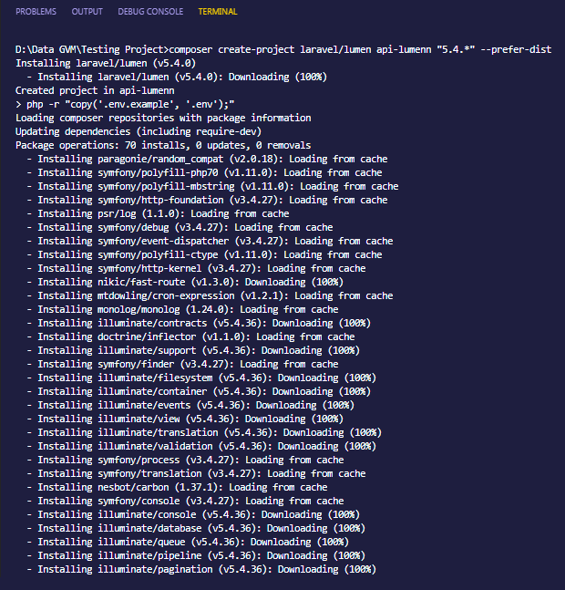

# install lumen
- Pastikan versi anda di *versi 5.6*, lalu ketikan perintah berikut di CLI anda :  
`composer create-project laravel/lumen todoLumen "5.4.*" --prefer-dist` dan jika php anda lebih dari *versi 5.6* atau *versi 7* anda bisa menginstall dengan perintah berikut	`composer create-project laravel/lumen todoLumen --prefer-dist` untuk detail informasi prasyarat bisa di lihat di documentasi lumen berikut ini : [https://lumen.laravel.com/docs/5.8](https://lumen.laravel.com/docs/5.8).
  (gambar: installation lumen)