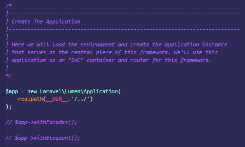
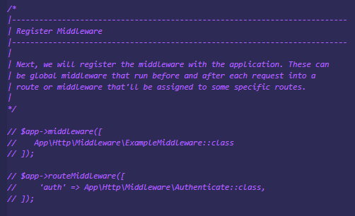

# Konfigurasi file .env
- Buka file .env dan edit file tersebut dengan mengubah bagian : `CACHE_DRIVER`, menjadi `CACHE_DRIVER= file`
- Buka bootstrap dan cari file *app.php*, uncomment bagian ini : 
  
*gambar : kofigurasi 1*

```php
    $app->withFacades();
    $app->withEloquent();
```  
Dan pada bagian Register Service Providers, juga di ubah menjadi berikut ini

  
*gambar : konfigurasi 2*

```php
    $app->register(App\Providers\AppServiceProvider::class);
    $app->register(App\Providers\AuthServiceProvider::class);
    $app->register(App\Providers\EventServiceProvider::class);
```  
itulah beberapa bagian yang dirubah untuk konfigurasi di lumen.
