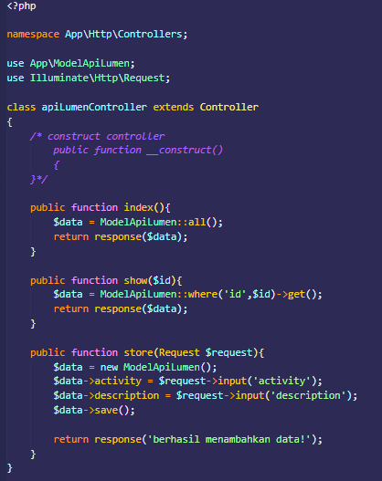

# Membuat Controller
- Untuk cara membuat controller nya , dengan cara masuk ke folder *app>http* dan buat controller nya sebagai berikut :  
  
*gambar : controller*  
File controller ini diberi nama dengan ApiLumenController.php.  

- Selanjutnya kita mulai merubah, bagian controller nya untuk lebih detailnya apa yang dirubah dan ditambahkan kedalam controller nya adalah sebagai berikut :
    - Import modelnya
    - Import juga http request nya juga  
  
*gambar : controller*  
