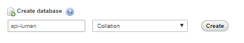

# Membuat Database
Untuk membuat sebuah database ada beberapa cara yang bisa dilakukan, yang pertama teman-teman bisa membuat sebuah database baru melalui phpMyadmin jika anda menggunakan database mySQL dan menggunakan tools XAMPP.  
detail cara nya adalah sebagai berikut :  
- Masuk ke halaman phpMyadmin yang ada di localhost anda dengan mengetikan di link `http://localhost/phpmyadmin` di url bar browser anda.
- Lalu anda tinggal buat database seperti pada gambar dibawah ini.  
  
*gambar : create database*