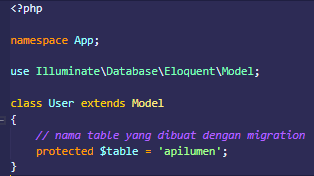
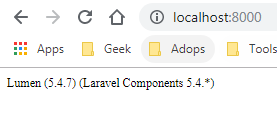

# Membuat Model
 selanjutnya membuat models. Untuk membuat model yang harus dilakukan adalah masuk kedalam folder App> lalu copy paste file user.php dengan nama baru yaitu ModelApiLumen.php  dan rubah file nya karena kita hanya  menggunakan model untuk protected table nya saja untuk detail apa yang harus dirubah berikut adalah :
  
Setelah membuat model, saatnya kita mulai coding, dan untuk mencoba menjalankan lumen yang kita buat ada beberapa yang bisa dilakukan :  
 - `php -S localhost:8000 -t ./public`
 - `php artisan serve  `
	Dan jika  berhasil maka akan muncul seperti berikut :  
  

