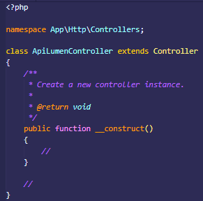

# Membuat Model
 selanjutnya membuat models. Untuk membuat model yang harus dilakukan adalah masuk kedalam folder App> lalu copy paste file user.php dengan nama baru yaitu ModelApiLumen.php  dan rubah file nya karena kita hanya  menggunakan model untuk protected table nya saja untuk detail apa yang harus dirubah berikut adalah :
