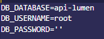
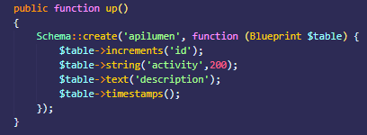
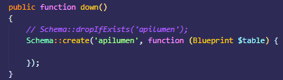
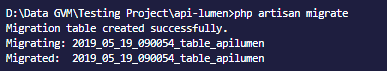

# Membuat Tabel Menggunakan Migration  
Jika selesai membuat sebuah database yang sebelumnya dibuat di mySQL, selanjutnya adalah membuat tabel dengan cara migration data. untuk detailnya adalah sebagai berikut :  
 - Masuk terlebih dahulu kedalam file konfigurasi *.env* untuk menkonfigurasi database mana yang akan dipakai.   
  
*gambar : konfigurasi file .env*  

jika sudah melakukan konfigurasi untuk database mana yang akan digunakan langkah selanjutya adalah membuat table migration nya, cara membuat nya adalah kamu bisa mengetikan perintah berikut pada command line interface kamu berikut adalah perintah untuk membuat table dengan migration :  

`php  artisan make:migration create_apilumen_table --create=apilumen`

  
*gambar : membuat file migration*  
- Setelah melakukan proses membuat table migration, lalu anda cek terlebih dahulu di folder *database > migration* dan cari nama file migration yang sebelumnya dibuat.  
- Lalu tambahkan kolom seperti berikut :  
  
  
- Lalu jalankan perintah migrate dengan cara mengetikan perintah berikut  
 `php artisan migrate`  
 dan hasil dari proses nya dari migrate adalah sebagai berikut :  
  

